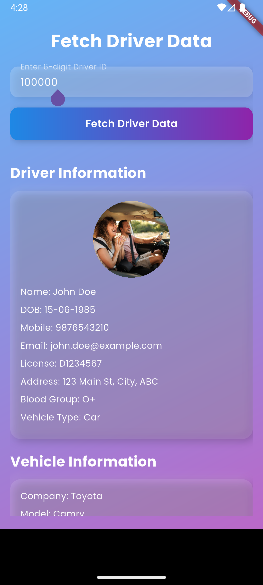
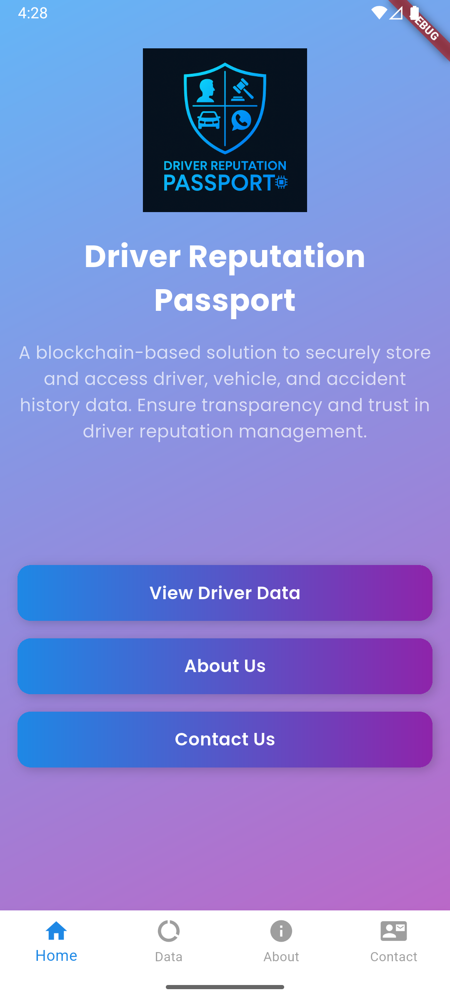
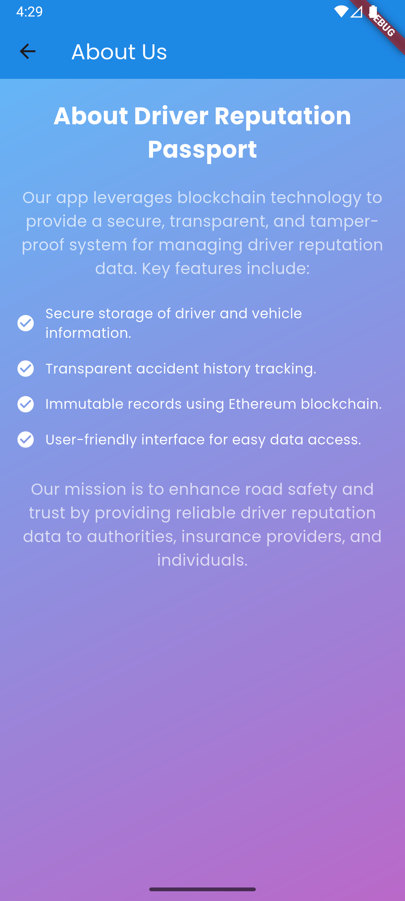
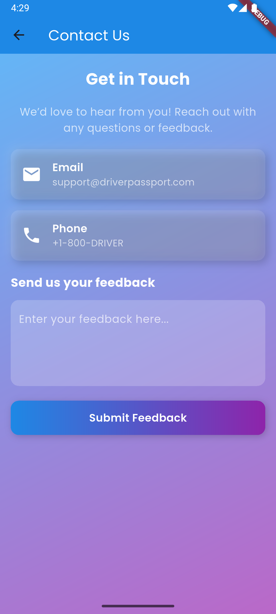

# Driver Reputation Passport Flutter App 🚘🔗

A futuristic and educational **Flutter** app that connects to an Ethereum **Solidity smart contract** (`DriverReputationPassport`) deployed locally via **Ganache**. With this app, users can easily fetch and view verified **driver profiles, accident records, and vehicle details** by entering a simple 6-digit driver ID.

---

## 🚀 Features

* 🔍 **Driver Data Retrieval**
  Enter a 6-digit driver ID to fetch verified **driver profile**, **vehicle info**, and **accident history** directly from the blockchain.

* 🖥️ **Futuristic & Clean UI**
  A responsive, card-based layout optimized for web, Android, and iOS with smooth interactions and feedback.

* 🔗 **Blockchain-Powered**
  Interacts seamlessly with a **Ganache** Ethereum node using the `web3dart` package.

* ⚠️ **Robust Error Handling**
  Invalid ID? No data? Network issue? The app informs the user clearly and helpfully.

* 🧱 **Modular Architecture**
  Clear and well-separated logic for UI, models, and blockchain services.

---

## 📲 Download the APK

👉 [Click here to download the APK](https://drive.google.com/file/d/1XVF-YT0rB6JRd5F6QODrNP3oUCQ58rG3/view?usp=drivesdk)

---

## 🧭 App Screenshots

| Home Screen                        | Valid Driver Data                  | Vehicle Info                       | Accident History                   |
| ---------------------------------- | ---------------------------------- | ---------------------------------- | ---------------------------------- |
|  |  |  |  |

---

## 🧱 Project Structure

```
lib/
├── main.dart               # App entry point
├── home_screen.dart        # Main screen with input and data cards
├── blockchain_service.dart # All Web3 and contract interaction logic
├── models.dart             # Data models for Driver, Vehicle, Accident
├── theme/                  # Styling and theme customization
├── splash/                 # Splash screen and initial loading
```

---

## 🎓 Learning Outcomes

This project is ideal for **students and enthusiasts** exploring how to merge **blockchain** with **mobile development** using Flutter.

* 🧠 Understand **Flutter UI basics**: `StatefulWidget`, `TextField`, `Card`, `ElevatedButton`
* 🔄 Learn **state management** using `setState`
* 🔐 Discover how to **interact with Ethereum smart contracts** using `web3dart`
* 🧰 Model Solidity structs in **Dart classes**
* 🛠️ Build robust apps with clear **error handling**
* 📦 Follow a **modular architecture** for scalability

---

> Built with ❤️ to explore the intersection of **Flutter** and **blockchain** development.
